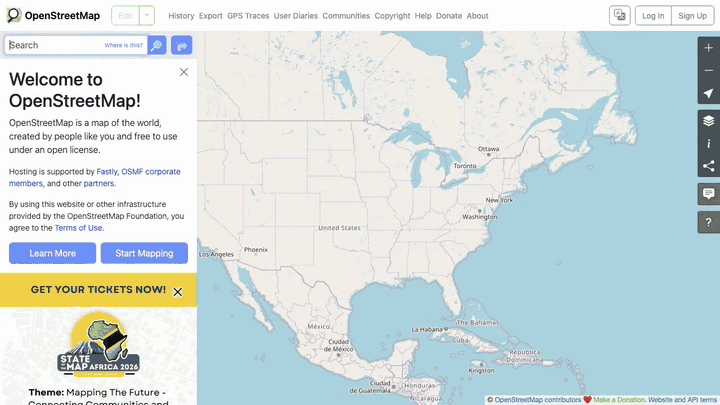
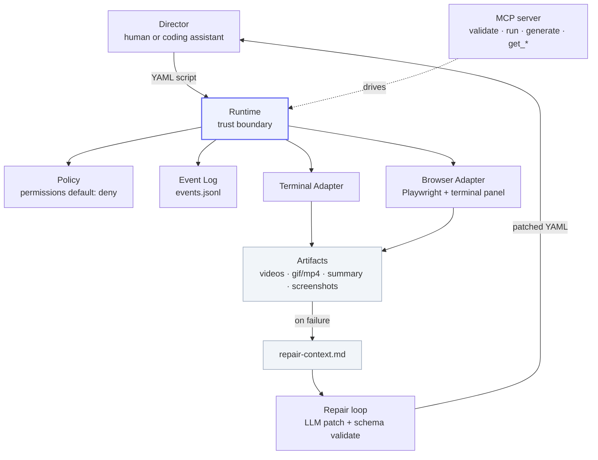

<div align="center">

# TraceCast

**Demo-as-code.** Write a YAML script, get a reproducible **terminal + browser** demo.
Regenerates in CI. Coding assistants can write and repair them.

[](https://github.com/bharath03-a/TraceCast/actions/workflows/ci.yml)
[](LICENSE)




<sub>Above: [`examples/maps.tracecast.yaml`](examples/maps.tracecast.yaml) — search a place on OpenStreetMap, recorded straight from YAML.</sub>

</div>

> Think **VHS, but for whole workflows** — terminal *and* browser in one script — and
> agents can generate them via MCP and self-heal them when they break.

## Why

Demos rot. README GIFs, PR walkthroughs, bug repros, onboarding clips — all recorded by
hand, all stale the moment the code changes. TraceCast makes a demo a **script you commit**,
so it regenerates on every push instead of being re-recorded by a human.

## Quick start

```bash
npx tracecast run examples/hello.tracecast.yaml
```

One command → a recorded run in `.tracecast/runs/<timestamp>-hello-tracecast/` with a
GIF, a structured event log, and a summary. No config, no account.

```yaml
name: hello-tracecast

permissions:
  terminal: allow
  browser: allow

recording:
  output:
    format: gif          # webm | mp4 | gif

steps:
  - terminal:
      run: echo "Starting TraceCast demo"

  - browser:
      open: demo-target.html

  - browser:
      type: { selector: "#demo-name", text: "TraceCast" }

  - browser:
      click: "#run-demo"

  # Assertions turn a demo into a smoke test — broken demo fails loudly.
  - assert:
      selector: "#result"
      contains: "workflow recorded"
```

## How it compares

|  | terminal | browser | reproducible | CI-native | agent-native | self-healing |
|--|:--:|:--:|:--:|:--:|:--:|:--:|
| VHS | ✅ | ❌ | ✅ | ✅ | ❌ | ❌ |
| Playwright | ❌ | ✅ | ⚠️ | ✅ | ❌ | ❌ |
| Loom / Screen Studio | ✅ | ✅ | ❌ | ❌ | ❌ | ❌ |
| **TraceCast** | ✅ | ✅ | ✅ | ✅ | ✅ | ✅ |

Terminal output is rendered into the recording via an embedded panel, so a single video
shows both your CLI and your browser.

## Commands

```bash
tracecast run <script>        # run a script and record it
tracecast validate <script>   # validate without running
tracecast watch <script>      # re-run on every save
tracecast schema [--out f]    # print the JSON Schema (for agent generation)
tracecast init                # check env, install Chromium
tracecast mcp                 # start the MCP server (stdio) for Claude / Codex
tracecast repair <run-dir>    # LLM-patch a failed run into a working script
```

## AI-native

TraceCast is built for coding assistants to drive end to end:

- **MCP server** (`tracecast mcp`) — tools: `validate`, `run`, `get_artifacts`,
  `get_event_log`, `generate_script`. Sample config in [`mcp-config.json`](mcp-config.json).
- **JSON Schema export** (`tracecast schema`) — fully-inlined schema so an LLM can
  generate valid scripts. Prompt template in [`prompts/generate-script.md`](prompts/generate-script.md).
- **Self-healing repair loop** (`tracecast repair <run-dir>`) — a failed run writes a
  `repair-context.md`; the repair command asks an LLM for a minimal patch, validates it
  against the schema, retries once on invalid output, and writes a working script.

**The full loop:** an assistant generates a script → runs it → on failure calls
`repair` → re-runs the patched script. No human in the loop.

## Artifacts

Every run writes to `.tracecast/runs/<timestamp>-<name>/`:

- `events.jsonl` — structured event log (every action, an audit trail)
- `summary.json` — status, step results, durations, artifact paths
- `videos/` — raw Playwright recording (terminal rendered in via the panel)
- `composed/` — GIF/MP4 export (when `output.format` is set and ffmpeg is installed)
- `screenshots/` — failure screenshots and any `screenshot` steps
- `repair-context.md` — written on failure, feeds the repair loop

## Architecture

Script-first, agent-compatible, runtime-controlled. A **Director** (human or assistant)
only *proposes* steps — the **Runtime** owns execution, policy, logging, and recording.



- the **Director** proposes steps; the **Runtime** validates policy and executes
- **adapters** perform terminal and browser work; every action hits the **Event Log**
- recordings become **artifacts**, composed into GIF/MP4
- a failed run writes `repair-context.md` → the **repair loop** patches the script → loop closes

Permissions (`terminal` / `browser` / `network`) default to **deny**, so an untrusted
Director can't do anything the script didn't grant.

## Examples & ecosystem

- [`examples/`](examples/) — `maps` (the demo above), `hello`, `tracecast-meta`,
  `git-log-demo`, `api-demo`, plus `summary-viewer.html`. See
  [examples/README.md](examples/README.md).
- [`record-action/`](record-action/) — a GitHub Action to run scripts in CI and upload
  recordings.

## Non-goals (on purpose)

TraceCast stays deterministic and dependency-light. **Out of scope:** native desktop app
capture, mobile, cloud rendering, and a visual editor. Focus is the feature — terminal +
browser, scripted, reproducible, agent-drivable.

## Development

```bash
npm install
npx playwright install chromium
npm run typecheck && npm test && npm run build
```

See [CONTRIBUTING.md](CONTRIBUTING.md). Requires Node >= 20. GIF/MP4 export needs `ffmpeg`
on the PATH (degrades gracefully to `webm` without it).

## License

[MIT](LICENSE) © Bharath Velamala
